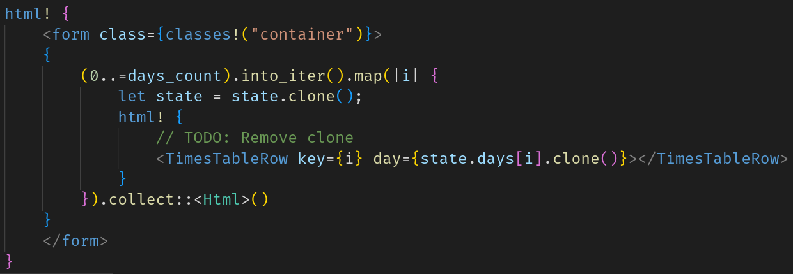

# yew-highlighting (VSCode extension)

Add syntax highlighting to [Yew](https://yew.rs/) `html!` macros in Visual Studio Code.

## ⚠️ Better Alternative ⚠️

[@TechTheAwesome](https://github.com/TechTheAwesome) has since made [a more complete extension](https://github.com/TechTheAwesome/code-yew-server). Future progress will be made on this extension, so check it out!

## Features

- Highlight `html!` macros using the XML syntax highlighting. This is still a
  work in progress.

  

## Known Issues

- "XML" (the text in the `html!` macros) is recognized as Rust code
  intrinsically.
- Since "XML" is still recognized as Rust, the Rust syntax highlighting
  sometimes takes over and colors XML incorrectly.

## Release Notes

See [CHANGELOG.md](CHANGELOG.md).
